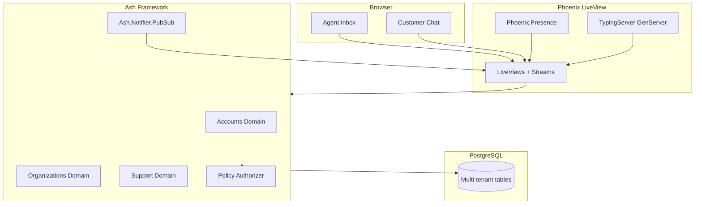

# AshDesk — Realtime Support Inbox

> A multi-tenant, realtime customer support inbox built with **Phoenix LiveView** and **Ash Framework**.
> An MVP simulation of Intercom's core workflow: customers message in, agents reply instantly.

[Elixir](https://elixir-lang.org/)
[Phoenix](https://www.phoenixframework.org/)
[Ash](https://ash-hq.org/)
[LiveView](https://hexdocs.pm/phoenix_live_view/)


---


## Overview

AshDesk is a focused SaaS MVP: a **multi-tenant support inbox** where customers start conversations and support agents respond in realtime — no page refreshes, no polling.

It models the essential Intercom loop:

- **Customer portal** — start a conversation, send messages, track status
- **Agent inbox** — filter, sort, and paginate conversations; assign agents; change status
- **Realtime engine** — live messages, online presence, and typing indicators

Built to demonstrate production-oriented Ash Framework: domain-driven design, declarative authorization, OTP supervision, and LiveView streams.

---


## Features


### For support agents

- **Live inbox updates** when customers open new conversations
- **Agent assignment** — take ownership of customer conversations
- **Status workflow**: `open` → `pending` → `resolved`
- **Online presence** — see who is in the conversation
- **Typing indicators** — realtime "user is typing…"

### For support admins

- **Admin panel** at `/admin/:slug/members` — manage organization members, assign roles, remove users
- **Full conversation control** — delete any conversation (agents cannot)


### For customers

- **Start conversations** with a subject line
- **Conversation history** with status badges
- **Instant message delivery** via LiveView streams


### Platform and security

- **Multi-tenant organizations** with slug-based URLs (`/kats-inc/inbox`)
- **AshAuthentication** — register, confirm email, password reset, remember me
- **Ash Policy Authorizer** — role-based access (admin / agent / customer)
- **Ash PubSub notifiers** — domain events drive UI updates

---


## Why Ash Framework?

This project uses [Ash Framework](https://ash-hq.org/) instead of plain Ecto. The tradeoffs are deliberate and worth explaining:


| Concern          | Plain Ecto approach                                         | Ash approach                                                                    |
| ---------------- | ----------------------------------------------------------- | ------------------------------------------------------------------------------- |
| Authorization    | `if` chains, `plug` pipelines, scattered checks             | `Ash.Policy.Authorizer` — declarative policies per resource/action              |
| Multi-tenancy    | Manual `WHERE org_id = ?` on every query                    | Declared once in `multitenancy do … end` — Ash appends the filter automatically |
| Realtime updates | Manual `Phoenix.PubSub.broadcast` calls in every controller | `Ash.Notifier.PubSub` — publish rules live alongside the resource               |
| API surface      | Custom functions per module                                 | Code interfaces — domain `define`s generate typed CRUD functions                |
| Business logic   | Scattered across controllers, channels, workers             | Bundled into resource `actions` — one place to reason about                     |


**Bottom line**: Ash trades a bit of compile-time magic (macros) for dramatically less boilerplate and a single source of truth for authorization, persistence, and notifications.

---


## Key Challenges & Solutions


### 1. Race-condition-free typing indicators

Each conversation gets an isolated `GenServer` started via `DynamicSupervisor`. The server tracks `%{user_id => timestamp}` and schedules a self-cleanup after an idle timeout. There is no shared mutable state — conversations never interfere.

```
Browser "typing" event → LiveView → TypingServer.start(conv_id)
                                     ├── broadcast(:typing, user_id)
                                     ├── schedule_cleanup(3s)
                                     └── auto-cleanup on idle
```


### 2. Authorization across three domains with overlapping roles

A user can be `admin` in one organization and `customer` in another. Ash's `Policy Authorizer` handles this with filter checks per action:

- **Read conversations**: authorized if the user is an `admin`, the `assigned_agent`, or the `customer` who started it
- **Create conversations**: any organization member
- **Update/destroy**: admins only
- **Change status**: admins and agents

### 3. LiveView streams for zero-overhead chat

Messages use `stream_insert` instead of reassigning the full list. When a new message arrives via PubSub, only one DOM node is patched. Combined with `Phoenix.Presence`, the UI shows who is online without re-rendering the entire conversation.

---


## Tech stack


| Layer    | Technology                                         |
| -------- | -------------------------------------------------- |
| Language | Elixir 1.20 / OTP 29                               |
| Web      | Phoenix 1.8, LiveView 1.2, Bandit                  |
| Domain   | Ash 3, AshPostgres, AshPhoenix, AshAuthentication  |
| Database | PostgreSQL                                         |
| Realtime | Phoenix PubSub, Phoenix.Presence, LiveView streams |
| UI       | Tailwind CSS v4, DaisyUI, Heroicons                |
| Tables   | Cinder                                             |


---


## Architecture:



Three Ash domains keep concerns separated:

```
Accounts/      → User auth (AshAuthentication, JWT tokens)
Organizations/ → Multi-tenancy (Organization, Membership roles)
Support/       → Product (Conversation, Message + PubSub notifiers)
```

**Multi-tenancy** uses Ash's attribute strategy — all support data is scoped by `organization_id`.

**Realtime flow:**

1. User sends a message → Ash `create` action on `Message`
2. `Ash.Notifier.PubSub` publishes to `conversation:messages:{id}`
3. LiveView subscribes and `stream_insert`s the message
4. Other participants see it instantly

**Typing indicators** use a per-conversation `GenServer` supervised by `DynamicSupervisor`, with auto-cleanup after idle timeout.

---


## Project structure

```
lib/
├── ash_desk/                        # Ash domain layer
│   ├── accounts/                    # Auth: User resource, Token, senders
│   │   ├── user.ex
│   │   ├── token.ex
│   │   └── user/senders/
│   ├── organizations/               # Multi-tenancy: Org, Membership
│   │   ├── organization.ex
│   │   └── membership.ex
│   ├── support/                     # Product: Conversation, Message
│   │   ├── conversation.ex
│   │   ├── message.ex
│   │   ├── typing_server.ex
│   │   └── changes/
│   ├── accounts.ex                  # Domain module with code interfaces
│   ├── organizations.ex
│   ├── support.ex
│   ├── repo.ex                      # AshPostgres.Repo
│   ├── secrets.ex
│   └── application.ex
├── ash_desk_web/                    # Phoenix web layer
│   ├── live/                        # LiveViews
│   │   ├── inbox_live/
│   │   ├── chat_live/
│   │   └── admin_live/
│   ├── components/                  # Layouts, CoreComponents, ChatComponents
│   └── controllers/
├── ash_desk_web.ex
└── ash_desk_web/router.ex
```

---


## Getting started


### Prerequisites

- Elixir 1.20+, Erlang/OTP 29+
- PostgreSQL


### Setup

```bash
git clone https://github.com/YOUR_USERNAME/ash_desk.git
cd ash_desk
mix setup
mix phx.server
```

Visit [http://localhost:4000](http://localhost:4000)

### Demo accounts

Seeded organization: **KATS Inc** (`/kats-inc`)


| Role  | Email                | Password      | URL               |
| ----- | -------------------- | ------------- | ----------------- |
| Admin | `admin@kats-inc.com` | `password123` | `/kats-inc/inbox` |


Sign in as admin to open the inbox, manage members at `/admin/kats-inc/members`, and assign agent or customer roles to other seeded users (`agent1@kats-inc.com`, `customer@kats-inc.com`).

**Tip:** open agent and customer sessions in two browsers to demo realtime chat side by side.

---


## Testing

```bash
mix test
mix precommit   # compile → format → test
```

---


## Author

**Martha M. Nieto** — [GitHub](https://github.com/marthanieto) · [LinkedIn](https://linkedin.com/in/marthanieto)

Built with Elixir, Phoenix, Ash Framework, and a lot of coffee.

---


## License

MIT